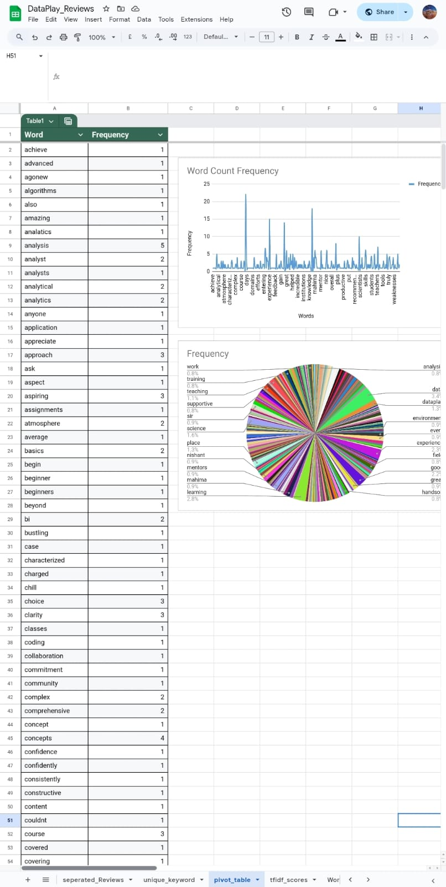
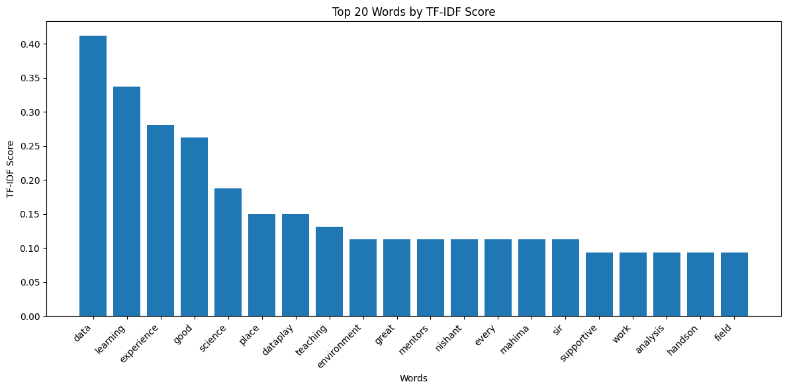
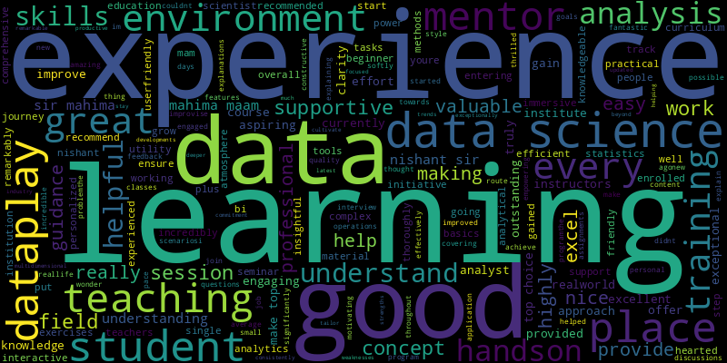
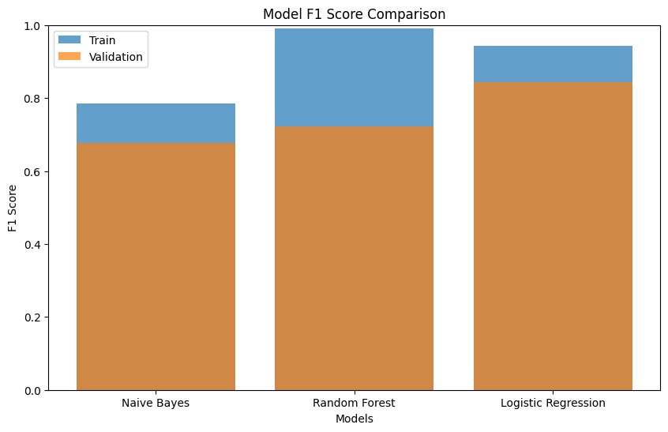
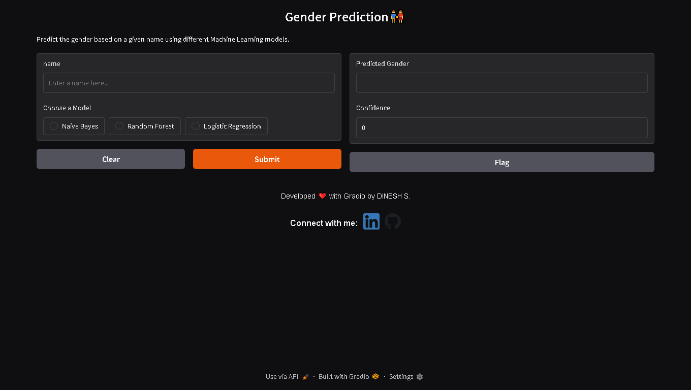
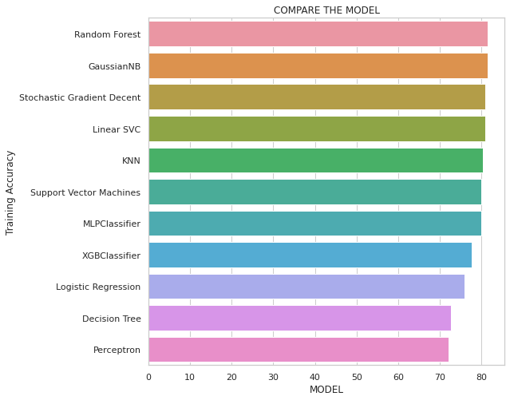
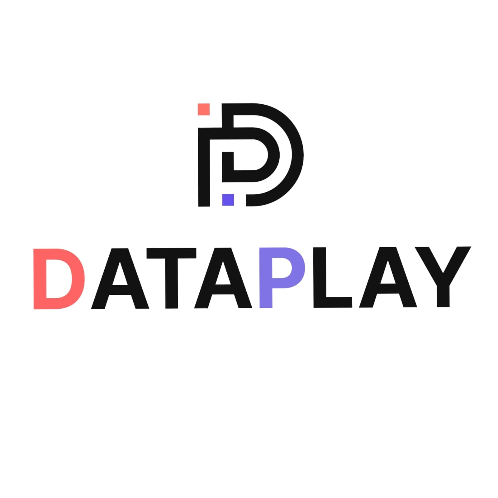

# Dataplay Data Science Fellowship Projects Repository


Welcome to my repository showcasing the projects and assignments I completed during the **Dataplay Data Science Fellowship**. In this repository, you'll find detailed work on data visualization, text analysis, and machine learning—from crafting word clouds and text analytics to developing predictive models and interactive web apps.


## Table of Contents

- [Introduction](#introduction)
- [Datasets](#datasets)
- [Entry Sheet](#entry-sheet)
- [Projects](#projects)
  - [1. DataPlay Reviews WordCloud](#1-dataplay-reviews-wordcloud)
  - [2. Gender Prediction](#2-gender-prediction)
  - [3. Titanic Dataset](#3-titanic-dataset)
- [Technologies & Tools](#technologies--tools)
- [Usage](#usage)
- [Contributing](#contributing)
- [License](#license)
- [Acknowledgements](#acknowledgements)
- [Contact](#contact)

---

## Introduction

This repository documents my journey through the **Dataplay Data Science Fellowship**, where I tackled real-world data science challenges using multiple tools and techniques. Each project showcases my skills in data processing, visualization, and machine learning, while also reflecting my passion for solving complex problems with data.

---

## Datasets

All datasets used in these projects are available here:  
[DataPlay Data Science Case Studies](https://github.com/DataPlayOrg/Data-Science-Case-Studies)


---

## Projects

### 1. DataPlay Reviews WordCloud

**Overview:**  
This project focuses on analyzing textual reviews and visualizing word frequencies through various implementations.

#### Workflow:

- **Level 1: Excel Implementation**
  - **Objective:** Use Excel functions and Pivot Tables to compute word frequency counts while removing stopwords.
   

- **Level 2: TF-IDF Implementation**
  - **Objective:** Apply TF-IDF (Term Frequency-Inverse Document Frequency) to weigh the importance of words.
  - **Output:** Enhanced visualization of key terms based on their calculated weights.
  - **Image Placeholder:**  
    


- **Level 3: Python Implementation**
  - **Objective:** Replicate all the above levels using Python to facilitate automated analysis and programmatic visualizations.
    

---

### 2. Gender Prediction

**Overview:**  
In this project, I built a predictive model to determine gender from a given dataset. The project involves detailed data exploration, model training, evaluation, and an interactive demonstration.

#### Workflow:

1. **Stratified Data Split**
   - **Task:** Partition the dataset into training and validation sets using stratified sampling. 

2. **Pivot Analysis on Training Data**
   - **Task:** Conduct pivot table analysis to explore the distribution and relationships in the training set.

3. **Model Prediction & Accuracy Calculation**
   - **Task:** Train models, generate predictions on both sets, and compute accuracy.

4. **Weighted F1 Score Calculation**
   - **Task:** Calculate the weighted F1 score to evaluate model performance comprehensively.

5. **Enhancement with Naïve Bayes**
   - **Task:** Improve the model by implementing a Naïve Bayes classifier.

   

6. **Interactive Gradio App**
   - **Task:** Develop a Gradio-based web app to demonstrate real-time gender prediction.
    

    Try app: [Link](https://huggingface.co/spaces/DINESH-X/Gender-Prediction-by-names)
---

### 3. Titanic Dataset

**Overview:**  
This project involves a comprehensive analysis of the Titanic dataset to predict passenger survival outcomes. It covers all stages of data science, including data cleaning, exploratory data analysis, feature engineering, and model evaluation.

#### Workflow:

- **Data Cleaning & Preprocessing**
  - **Task:** Handle missing values, encode categorical variables, and normalize the data.

- **Exploratory Data Analysis (EDA)**
  - **Task:** Analyze trends, correlations, and patterns within the dataset.

- **Feature Engineering**
  - **Task:** Create and transform features to improve model performance.

- **Model Building & Evaluation**
  - **Task:** Implement various predictive models, compare their performance using accuracy and F1 score, and select the best performing model.
  - **Image Placeholder:**  
    

---

## Technologies & Tools

- **Languages:** Python, SQL
- **Data Analysis & Visualization:** Excel, Power BI, Pandas, Matplotlib, Seaborn
- **Machine Learning:** Scikit-Learn, XGBoost, Naïve Bayes
- **Interactive Apps:** Gradio
- **Version Control:** Git, GitHub

---

## Usage

To run these projects locally, follow the steps below:

1. **Clone the Repository:**
   ```bash
   git clone https://github.com/itzdineshx/Data_Play_Fellowship
   ```

2. **Navigate to the Repository Directory:**
   ```bash
   cd your-repo
   ```

3. **Install Dependencies:**
   - Ensure you have Python (version 3.7 or later) installed.
   - Install the required libraries:
     ```bash
     pip install -r requirements.txt
     ```
   - If you are working with Power BI visualizations, make sure Power BI Desktop is installed.

4. **Run the Projects:**
   - Open the corresponding Jupyter notebooks or Python scripts in your preferred IDE.
   - For the Gradio app in the Gender Prediction project:
     ```bash
     python app.py
     ```
   - Refer to each project's individual README or comments within the notebooks for detailed instructions.

---

## Contributing

Contributions are welcome! If you'd like to enhance or add to these projects, please follow these steps:

1. **Fork the Repository.**
2. **Create a New Branch:**
   ```bash
   git checkout -b feature/your-feature-name
   ```
3. **Commit Your Changes:**
   ```bash
   git commit -m "Description of your changes"
   ```
4. **Push to Your Branch:**
   ```bash
   git push origin feature/your-feature-name
   ```
5. **Open a Pull Request** describing your changes.

---

## License

This project is licensed under the [MIT License](LICENSE). Please see the LICENSE file for more details.

---

## Acknowledgements

- **Dataplay:** For organizing the fellowship and providing challenging, real-world datasets.
- **DataPlayOrg/Data-Science-Case-Studies:** For the extensive datasets and case studies.
- **Mentors & Community:** For their continuous guidance, feedback, and support throughout this journey.


---

## Contact


DINESH S  
[my linkedin profile](https://www.linkedin.com/in/dinesh-x/) | [github link](https://github.com/itzdineshx/)
---

*Happy coding and happy data exploring!* 🚀
